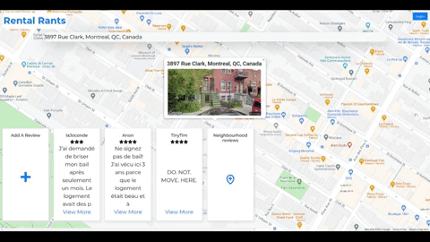
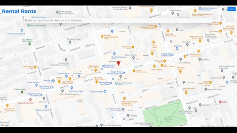

## Rental Rants (Lighthouse Labs Final Project)

### By: [Dan Robertson](https://www.github.com/danuhnder), [Emily Tupper](https://github.com/emtupp) and [Jared Flomen](https://github.com/JaredFlomen)

Rental Rants is a single page, mobile first web application where users can view and submit reviews of rental properties they have lived in. The client side harnesses Google Maps API for location search suggestions and latitude + longitude coordinates and is rendered with ReactJS and bootstrap components overlaying google-maps-react library elements. Persistent storage is managed by a PostgreSQL database with a NodeJS Express server handling API calls to the db. 

### Application in use

Search for a property and view reviews attached to it.

Reviews are stored by latitude and longitude coordinates. You can view what tenants living nearby had to say about their neighbourhood. 

Anyone can view reviews. To add a property review, login or create an account.

Enter your tenancy dates, leave a brief review and rating in each of the three categories and submit when you're happy!

### [Go play with it here](https://thirsty-jang-ea95c4.netlify.app/)

### Setup

Fork and clone this repository.

CD into backend, install dependencies with npm install.

CD into client, install dependencies with npm install, setup database with npm run db:reset

### Run the application

In one terminal window, start the backend with npm run dev.

In another temrinal window, start the client with npm start.

The app will be served at http://localhost:3000/.

Go to http://localhost:3000/ in your browser.

